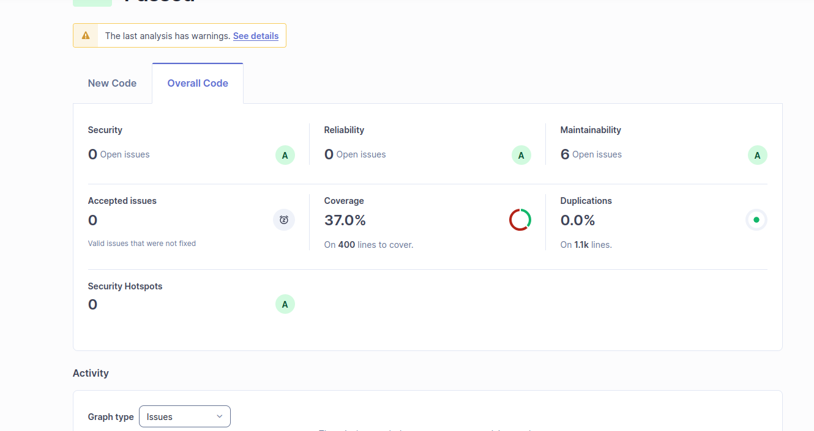

# CS Grade Calculator - UTEC

Sistema de cálculo de notas finales para UTEC desarrollado con FastAPI y arquitectura orientada a objetos.


## Resultados de calidad y análisis SonarQube

### Calidad requerida


### Resultado del alumno en SonarQube

## Características

- Cálculo de nota final con evaluaciones ponderadas
- Validación de asistencia mínima
- Política de puntos extra
- API REST con FastAPI
- CLI para pruebas rápidas
- Tests automatizados con cobertura ≥60%
- Análisis de calidad con SonarQube

## Requisitos

- Python 3.8+
- Docker (para SonarQube)

## Instalación

```bash
pip install -r requirements.txt
```

## Uso

### API REST

```bash
uvicorn src.api.main:app --reload
```

Acceder a:
- API: http://localhost:8000
- Swagger UI: http://localhost:8000/docs

### CLI

```bash
python src/cli/cli_main.py
```

## Tests

```bash
# Ejecutar tests
pytest tests/ -v

# Con cobertura
pytest tests/ --cov=src --cov-report=term-missing
pytest tests/ --cov=src --cov-report=xml
```

## SonarQube

```bash
# Iniciar SonarQube
docker-compose up -d

# Ejecutar análisis
sonar-scanner \
  -Dsonar.projectKey=cs-grade-calculator \
  -Dsonar.sources=src \
  -Dsonar.host.url=http://localhost:9000 \
  -Dsonar.token=squ_b1d0cf13ebb63ba7feff2ba23e0fd1e8a9db8cc2
```

Ver resultados en: http://localhost:9000/dashboard?id=cs-grade-calculator

## Estructura del Proyecto

```
src/
├── models/          # Modelos de datos
├── policies/        # Políticas de negocio
├── calculator/      # Lógica de cálculo
├── storage/         # Persistencia
├── api/            # API REST
└── cli/            # CLI
tests/              # Tests automatizados
data/               # Almacenamiento JSON
```

## Requisitos Funcionales

- RF01: Registrar evaluaciones con nota y peso
- RF02: Validar asistencia mínima
- RF03: Aplicar política de puntos extra
- RF04: Calcular nota final (determinista)
- RF05: Visualizar detalle del cálculo

## Requisitos No Funcionales

- RNF01: Máximo 10 evaluaciones por estudiante
- RNF02: Soporte 50 usuarios concurrentes
- RNF03: Cálculo determinista
- RNF04: Tiempo de cálculo < 300ms
